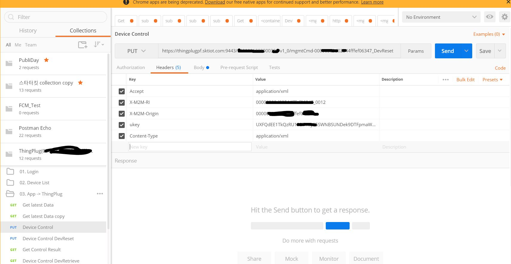
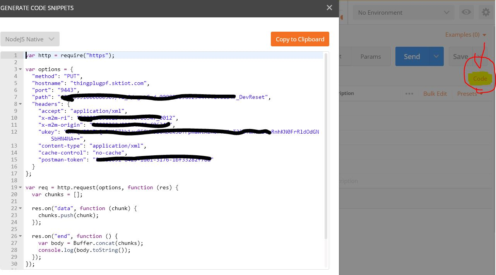
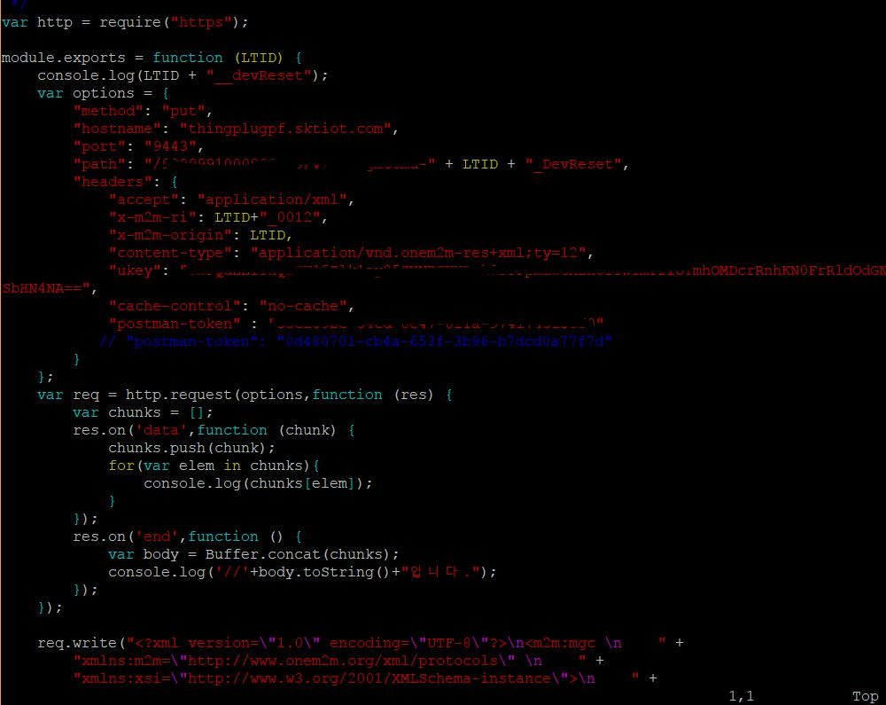

## 소개

### UpLink / DownLink 설명 
### ▶ <a href="https://github.com/Haamseongho/ubinet_arduino"> 업링크와 다운링크 설명 </a>

<hr />

 **LoRa해더 파일** 은 기존의 시리얼3번을 통해 LoRa모듈과 아두이노 간의 통신을 보다 더 쉽게 하기 위해 만들어진 것으로, 
 본 프로젝트 작업 간에 유용하게 쓰기 위해서 추가 구성하여 정리하였음. 

---
#### 해더 파일에서 주요 코드  *상용화에 필수 요소들* 


### 1. LoRa.init() 

> LoRa모듈을 초기화 시키는 것 
>   
>   - LoRaDrv.cpp에서 LoRaSerial을 초기화 시킨다.
>   - Parameter로 시리얼 주소 값이 들어간다.
> > Serial3.begin(38400);
> 
> > LoRa.init(&Serial3);

: 38400 baud rate로 모듈과 디바이스 간 시리얼 통신을 열어두고 (Rx , Tx) 이를 LoRa 해더파일을 이용하여 초기화 시킨다.

#### *장점* : 모듈 초기화에 따른 로그 모니터링이 가능하며 문제 해결에 큰 도움이 된다. 또한 코드가 보다 더 간결해질 수 있다.
 
( 관련 로그를 띄우는 것도 코드 상 길어지지만 본 해더파일을 사용할 시에 로그 모니터링이 쉽게 해결될 뿐만 아니라 이 내용들은 상용화에 필수 요소들임 )

### 2. LoRa.begin()

> LoRa 모듈을 리셋하고 다시 LoRa기지국에 Join Request를 보내는 것

> LoRa.begin() 명령어 입력 시에 시리얼 3번의 주소 값을 이미 가지고 있기 때문에 디바이스에서 모듈로 자동 "AT+RST\r\n" 를 보낸다.
> 이 후에는 JOINED 요청을 다시 보내고 타임 아웃시에 리셋을 다시 요청하도록 되어 있다. (Tx Radio Done)


### 3. LoRa.send()

> data를 보내는 부분으로 LoRa.send(char *data) 값이 들어간다.

> 1. 데이터를 보내는 부분으로 디바이스에서 LoRa모듈로 전송하는 것이기에 UpLink에 해당한다.
> 2. "AT+SEND 01%s\r\n",data 를 포함하고 있는 내용이라 초기 포트번호로 01을 주고 이 후 데이터 값은 %s로 받아서 전송된다.
> 3. LoRaBuf(로라 버퍼)에 데이터가 없을 경우 버퍼를 리셋하고 자리를 비워둔다.


### 4. LoRa.available()

> LoRa를 Serial3의 주소 값과 매칭하여 작업하는데 이 Uart통신이 유효한지를 확인하는 부분이다.

> 주로 여기서는 위 구문을 조건절에 넣고 조건이 허가될 때 업링크와 다운링크 작업을 진행한다. 


### 5. LoRa.read()


> LoRaSerial을 통해서 들어온 내용으로 LoRa모듈로 역제어가 걸릴 경우 생기는 스트림 형태의 내용이다.

> 쉽게 설명하자면 Serial3으로 들어온 내용을 확인한다고 보면 되고, 이는 주로 다운링크에 해당한다. 

### 6. LoRa.Get()

> LoRa.Get(char* data, char* response,int timeout)

> 1. LoRa로 내려온 커멘드를 가지고 오는 것으로 요청 데이터에 따른 응답을 뿌려준다. 
> 2. 뿌려준 응답이 제 시간에 뜨지 않을 경우 타임아웃이 걸려서 연결 실패가 뜰 가능성이 있다.

### 7. LoRa.Set()

> LoRa.Set(char* data, char* response, int timeout)

> 1. Get과 비슷한 구조이나, 이는 Get에서 응답이 안올 경우 커멘드를 내려서 설정해주는 부분이다
> 2. 예를 들어 클래스 타입을 가지고 왔는데 클래스 타입이 설정이 안되어 있을 경우 에러가 나기 때문에 Set을 통하여 클래스 타입을 정해준다.


<br />

## Installation 


### 1. SKT_LoRa.h 다운로드 

#### 1.1. <a href="https://github.com/Haamseongho/ubinet_arduino/tree/master/downloads/solum_lora_library.zip"> 솔루엠 해더파일 및 라이브러리 전체 다운로드 </a>

#### 1.2. <a href="https://github.com/Haamseongho/ubinet_arduino/tree/master/downloads/SKT_LoRa_cpp.zip"> 주요 해더파일만 정리된 cpp 소스코드 다운로드 </a>


#### 1.3.  <a href="https://github.com/Haamseongho/ubinet_arduino/blob/master/downloads/Timer-master.zip"> Timer.h 다운로드  </a>


#### 1.4.    Usage & Information ( reference : <a href="https://playground.arduino.cc/Code/Timer"> https://playground.arduino.cc/Code/Timer )</a>

<br />

### 2. Arduino 라이브러리 zip파일로 추가하기 

### 3. UpLink Library Installation


```
	$git clone https://github.com/Haamseongho/LoRa_oss.git
	
```

### 4. DownLink Library Installation

```
	$git clone https://github.com/Haamseongho/LoRa_oss.git
	
```


- 같은 레퍼짓토리에 다른 폴더로 정리 되어 있기 때문에 둘을 같이 정리하면 하나의 완성 프로젝트로 체크할 수 있습니다. 
- 따로 정리한 이유는 다른 센서 코드들과 같이 합쳐서 종합할 때 편하게 하기 위함입니다.


---
###  UpLink  : Device -> LoRa -> ThingPlug Server-> Cloud Server -> Web/App

- UpLink는 아두이노 부분에서 본 해더파일을 라이브러리에 추가하고 코드를 받아서 
실행하면 됩니다.

<br />

###  DownLink : Web/App -> Cloud Server -> THingPlug Server -> LoRa -> Device 

- DownLink는 클라이언트를 통해서 클라우드 서버에 신호를 보내고 클라우드 서버에서 
LoRa 모듈을 통해 디바이스에 역제어를 거는 형식입니다.

∴  다운링크는 업링크와 다르게 서버 파트에서 작업이 필요합니다.

---
## How to control device by down-link

### Installation

```
	$ git clone https://github.com/Haamseongho/ubinet_Server.git
	$ npm install (클론 받은 로컬 저장소에서)
	
```


### Usage

---

#### 1. POSTMAN에서 ThingPlug 서버와 소통하고자 header 부분 그리고 end-point 부분을 맞춰 준다.


#### ▶ <a href="https://github.com/Haamseongho/ubinet_Server.git"> ThingPlug 서버 디바이스 등록 및 Ukey 받는 작업 & PostMan 활용 방법  </a>

#### 2. POSTMAN을 이용하여 설정을 맞춰 주면 LoRa망을 통해 디바이스에 역제어를 걸 수 있습니다.

<br />




#### 3. clone받은 내용 중 route에서 dn_link 경로에 dev_reset.js를 활용합니다. 

#### 4. dev_reset.js 부분에는 개인 LTID와 uKey 그리고 postman-token을 설정해 줍니다. 


<br />

포스트 맨에서 설정한 내용에 대한 code 뽑아오기




<hr />




#### 5. dev_reset.js 부분이며 본 라우터에서 해당 디바이스에 역제어를 걸게 됩니다. (다운링크 완성)


---


### Acknowledgements 


- ThingPlug 일반 예제 공개 코드 :  <a href="https://github.com/SKT-ThingPlug/thingplug-starter-kit"> ThingPlug Starter-kit  </a> 
- firebase push : <a href="https://github.com/nandarustam/fcm-push"> nandarustam/fcm-push </a>
- facebook.api : <a href="https://github.com/Haamseongho/ubinet_Server/tree/master/fb_login"> 페이스북 계정 활용 로그인 </a>
- Kakao.api : <a href="https://github.com/Haamseongho/ubinet_Server/tree/master/kk_login"> 카카오 계정 활용 로그인  </a>


그 외 사용 OSS : - <a href="https://github.com/Haamseongho/ubinet_Server">
다른 OSS 활용 내용 정리 </a>

---

### License

MIT 

#### node license 
- <a href="https://github.com/nodejs/node/blob/master/LICENSE"> https://github.com/nodejs/node/blob/master/LICENSE</a>
